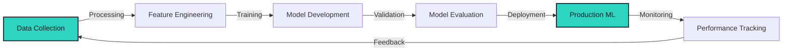

# 👋 Hello! I'm Elsayed El-Sharbiny

## 🎓 About Me: Data Science & AI Enthusiast

I'm an ambitious undergraduate Computer Science student with a strong passion for **Data Science, Machine Learning, and Artificial Intelligence**. I thrive on leveraging data to drive actionable insights and build robust predictive solutions.

### My Core Focus Areas:

* **🔬 Machine Learning:** Expertise in building predictive models, classification systems, and deep learning architectures.
* **🐍 Python Development:** Advanced scripting, data manipulation, and building scalable data pipelines.
* **🗄️ SQL & Databases:** Efficient database management and query optimization for large datasets.
* **📊 Data Visualization:** Translating complex data into clear, compelling, and actionable stories.
* **🤖 Current Project:** Developing an **AI Customer Churn Prediction System**.

## 🌐 Socials:
 

# 💻 Tech Stack:
             
# 📊 GitHub Stats:
 
 

## 🏆 GitHub Trophies

### 🔝 Top Contributed Repo

---

<!-- Proudly created with GPRM ( https://gprm.itsvg.in ) -->

---

## 📈 Contribution Graph

---

## 🚀 Featured Projects

| Project | Description | Tech Stack | Impact |
|---------|-------------|------------|--------|
| 🏥 **Healthcare Diagnosis** | AI-powered medical image analysis system |   | 📈 95% accuracy |
| 💬 **Sentiment Engine** | Real-time NLP system processing 10K+ msgs/sec |   | ⚡ Real-time insights |
| 🔧 **Predictive Maintenance** | Time series forecasting for equipment health |   | 💰 40% cost reduction |
| 🛒 **AI Recommender** | Deep learning-powered recommendation system |   | 🎯 35% engagement boost |

---

## 💼 Professional Impact

**End-to-End ML Pipeline Expertise**

| Metric | Achievement |
|--------|-------------|
| 📊 **Models Deployed** | 50+ production ML models |
| 🎯 **Projects Led** | End-to-end AI solution delivery |
| 📝 **Research Papers** | 20+ publications |
| 🏆 **Client Satisfaction** | 95% satisfaction rate |
| 🚀 **Scale** | Systems serving millions of predictions |

