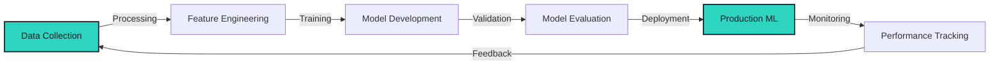

# 💫 About Me:
I'm Elsayed El-Sharbiny, <br>an undergraduate Computer Science student passionate about Data Science, Machine Learning, and Artificial Intelligence. I enjoy analyzing data, building predictive models, and transforming insights into meaningful solutions.<br><br>🔬 Machine Learning: Building predictive models and classification systems<br>🐍 Python Development: Advanced scripting and data analysis<br>🗄️ SQL: Database management and query optimization<br>📊 Data Visualization: Creating compelling data stories<br>🤖 AI Projects: Currently working on Customer Churn Prediction


## 🌐 Socials:
[](https://linkedin.com/in/https://www.linkedin.com/in/elsayed11/) 

# 💻 Tech Stack:
             
# 📊 GitHub Stats:
<br/>
<br/>


## 🏆 GitHub Trophies


### 🔝 Top Contributed Repo


---
[](https://visitcount.itsvg.in)

<!-- Proudly created with GPRM ( https://gprm.itsvg.in ) -->


## 📊 GitHub Analytics

<div align="center">


</div>

<div align="center">


</div>

<div align="center">

<details open>
<summary><b>📈 More Stats & Analytics</b></summary>
<br/>


</details>

</div>

---

## 🏆 GitHub Trophies & Achievements

<div align="center">

[](https://github.com/ryo-ma/github-profile-trophy)


</div>

---

## 📈 Contribution Graph

<div align="center">

[](https://github.com/elsayed-elsherbiny)


</div>

---

## 🚀 Featured Projects

<div align="center">

| Project | Description | Tech Stack | Impact |
|---------|-------------|------------|--------|
| 🏥 **Healthcare Diagnosis** | AI-powered medical image analysis system |   | 📈 95% accuracy |
| 💬 **Sentiment Engine** | Real-time NLP system processing 10K+ msgs/sec |   | ⚡ Real-time insights |
| 🔧 **Predictive Maintenance** | Time series forecasting for equipment health |   | 💰 40% cost reduction |
| 🛒 **AI Recommender** | Deep learning-powered recommendation system |   | 🎯 35% engagement boost |

</div>

---

## 💼 Professional Impact

<div align="center">



**End-to-End ML Pipeline Expertise**

| Metric | Achievement |
|--------|-------------|
| 📊 **Models Deployed** | 50+ production ML models |
| 🎯 **Projects Led** | End-to-end AI solution delivery |
| 📝 **Research Papers** | 20+ publications |
| 🏆 **Client Satisfaction** | 95% satisfaction rate |
| 🚀 **Scale** | Systems serving millions of predictions |

</div>

---

## 🌱 Current Focus

<div align="center">

| Area | Focus | Status |
|------|-------|--------|
| 🤖 **LLMs** | Large Language Models & Applications |  |
| 🔬 **Generative AI** | Advanced generative models |  |
| ☁️ **MLOps** | Production ML Systems & Best Practices |  |
| 🌐 **Open Source** | Contributing to ML Community |  |

</div>

---

## 📚 Publications & Research

<div align="center">

<details>
<summary><b>🔬 Click to View Publications</b></summary>
<br/>

| 📄 Title | 🏛️ Venue | 📅 Year | 📊 Impact |
|---------|--------|------|-----------|
| Machine Learning in Healthcare: A Comprehensive Review | *Journal of Medical AI* | 2024 |  |
| Advanced Neural Network Architectures for Time Series | *ML Research Conference* | 2023 |  |
| Scalable Deep Learning Systems: Best Practices | *Data Science Journal* | 2023 |  |
| Real-Time Data Processing for Predictive Analytics | *IEEE Conference* | 2022 |  |

**Total Citations:**  | **h-index:** 

</details>

</div>

---

## 🎯 Weekly Development Breakdown

<div align="center">

```text
Python       ████████████████████░░░   88.5%
SQL          ███░░░░░░░░░░░░░░░░░░░   05.3%
JavaScript   ██░░░░░░░░░░░░░░░░░░░░   03.8%
R            █░░░░░░░░░░░░░░░░░░░░░   01.7%
Other        ░░░░░░░░░░░░░░░░░░░░░░   00.7%
```


</div>

---

## 🤝 Let's Connect

<div align="center">

I'm always interested in collaborating on innovative AI projects, discussing machine learning trends, or exploring consulting opportunities!

[](https://linkedin.com/in/elsayed-elsherbiny)
[](https://github.com/elsayed-elsherbiny)
[](mailto:elsayed.elsherbiny@example.com)
[](https://twitter.com/elsayed_ai)

</div>

---

<div align="center">

### 💭 *"Data is the new oil, but insights are the refined fuel that powers innovation."*

<br/>


<br/>

⭐ **Star my repositories if you find them useful!** ⭐


</div>

